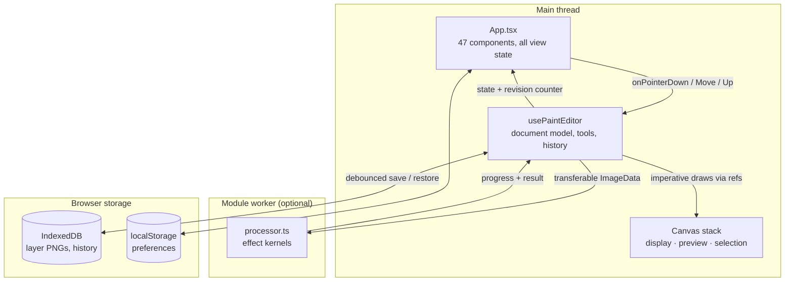
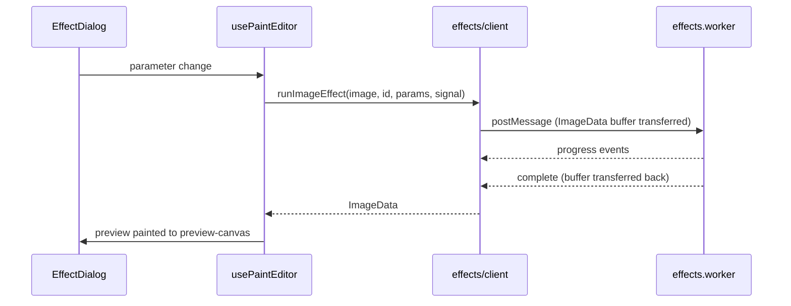

# Architecture of the Pinta Online web implementation

Pinta Online is a browser port of [Pinta 3](https://www.pinta-project.com/), a GTK image editor
written in C#. The original source is vendored under [`original/`](../original/) and is treated as
the specification: when a behaviour is ambiguous, the C# is read and transcribed rather than
guessed at. Parity findings live in [`parity-hardening.md`](parity-hardening.md) and
[`dialog-audit/`](dialog-audit/).

This document describes how the web side is put together — what the pieces are, how a pixel gets
from a pointer event to the screen, and where the design deliberately diverges from the desktop.

---

## 1. Shape of the codebase

Roughly 26,500 lines of committed TypeScript and CSS across 86 files, excluding the generated
locale catalogs. The stylesheet is now the only very large file:

| Area | File | Lines | Role |
| --- | --- | ---: | --- |
| Styling | [`src/styles.css`](../src/styles.css) | 5,854 | The entire visual system, including a libadwaita-derived token set |
| Editor core | [`src/editor/usePaintEditor.ts`](../src/editor/usePaintEditor.ts) | 2,621 | Document model, tools, history — composed from seven sub-hooks |
| User interface | [`src/App.tsx`](../src/App.tsx) | 1,429 | Menus, docks, toolbars, and the dialog hosts |
| Effect dispatch | [`src/effects/processor.ts`](../src/effects/processor.ts) | 196 | Routes each effect id to a kernel in `effects/kernels/` |

The kernels those last two used to contain now live in six files under
[`src/effects/kernels/`](../src/effects/kernels/), split along the effect catalog's own categories:
`shared.ts` (647), `pixelOps.ts` (595), `distortions.ts` (530), `artistic.ts` (402),
`generators.ts` (388), `blur.ts` (261).

The editor sub-hooks live beside `usePaintEditor.ts` and each takes an explicit dependency object
naming exactly what it touches: `useToolSettings`, `useImageCommands`, `useEffectRunner`,
`useLayerCommands`, `useSelectionCommands`, `usePaletteState`, `useFileCommands`, plus
`workspaceSerialization.ts` for the IndexedDB round-trip. UI-side concerns are in
[`src/hooks/`](../src/hooks/): `useViewportZoom` (369), `useClipboardBridge` (134),
`useBulkDocumentActions` (132), `usePrintAndScreenshot` (103), `useToast` (31).

The remaining modules are small and single-purpose:

| Module | Lines | Responsibility |
| --- | ---: | --- |
| [`effects/types.ts`](../src/effects/types.ts) | 645 | Effect catalog: ids, categories, parameters, dialog shape |
| [`editor/imageCodecs.ts`](../src/editor/imageCodecs.ts) | 507 | BMP, TGA, TIFF, PPM encode/decode |
| [`components/ColorPickerDialog.tsx`](../src/components/ColorPickerDialog.tsx) | 420 | The full Pinta colour picker |
| [`editor/workspacePersistence.ts`](../src/editor/workspacePersistence.ts) | 378 | IndexedDB schema, migrations, quota handling |
| [`state/preferences.ts`](../src/state/preferences.ts) | 343 | Zustand store, persisted to `localStorage` |
| [`editor/shortcuts.ts`](../src/editor/shortcuts.ts) | 262 | Accelerator registry and resolution |
| [`editor/surfaceDiff.ts`](../src/editor/surfaceDiff.ts) | 181 | Port of native `SurfaceDiff` |
| [`editor/types.ts`](../src/editor/types.ts) | 330 | Shared model types |
| [`components/ErrorBoundary.tsx`](../src/components/ErrorBoundary.tsx) | 137 | Render-failure containment and recovery |
| [`effects/client.ts`](../src/effects/client.ts) | 136 | Worker RPC with main-thread fallback |
| [`i18n/index.ts`](../src/i18n/index.ts) | 128 | Locale selection and lookup |
| [`editor/palette.ts`](../src/editor/palette.ts) | 126 | Paint.NET, GIMP, PaintShop Pro palettes |
| [`editor/geometry.ts`](../src/editor/geometry.ts) | 119 | Affine composition, selection bounds |
| [`editor/openRaster.ts`](../src/editor/openRaster.ts) | 115 | `.ora` archive read/write |
| [`addins/registry.ts`](../src/addins/registry.ts) | 90 | Five bundled, opt-in add-ins |
| [`effects/curves.ts`](../src/effects/curves.ts) | 87 | Natural cubic spline for the Curves dialog |
| [`editor/workspaceRecovery.ts`](../src/editor/workspaceRecovery.ts) | 80 | Skip-restore escape hatch, emergency export |
| [`editor/selectionMorphology.ts`](../src/editor/selectionMorphology.ts) | 73 | Selection grow/shrink |
| [`errorReporting.ts`](../src/errorReporting.ts) | 71 | Analytics exception events, repeat collapsing |
| [`editor/zoom.ts`](../src/editor/zoom.ts) | 63 | Native zoom level model |
| [`editor/historyBudget.ts`](../src/editor/historyBudget.ts) | 54 | Memory-pressure eviction |
| [`editor/tools.ts`](../src/editor/tools.ts) | 39 | The 22 tool definitions |
| [`editor/canvasContext.ts`](../src/editor/canvasContext.ts) | 28 | Guarded `getContext('2d')` |
| [`effects/effects.worker.ts`](../src/effects/effects.worker.ts) | 28 | Worker entry point |
| [`main.tsx`](../src/main.tsx) | 18 | Application bootstrap |

**Scale of the port:** 22 tools, 55 effects and adjustments (46 built-in plus 9 behind bundled
add-ins), 30 selectable locales (29 generated catalogs plus English as the source), 193 approved
visual baselines.

---

## 2. Runtime architecture

Three execution contexts, and one of them is optional.



The worker is optional by design: if it cannot be constructed — a strict CSP, a chunk that will
not load offline — [`effects/client.ts`](../src/effects/client.ts) falls back to running the same
processor on the main thread. It blocks the UI and cannot be cancelled midway, which is why it is
a fallback and not the normal path.

### The view/model split

There is one React component that matters, `App`, and one hook that holds the document,
`usePaintEditor`. The split is deliberate and unusual enough to state plainly:

- **`usePaintEditor` owns everything about the image** — layers, selection, history, tools,
  clipboard, file I/O, persistence. It returns a 204-key object. Internally it keeps 34 pieces of
  React state and **66 refs**, because pointer handlers must read current values synchronously
  without waiting for a re-render.
- **`App` owns everything about the chrome** — menus, dialogs, docks, toolbars. The `App` function
  alone holds 48 pieces of state, almost all of it "is this dialog open".

Pixels never flow through React. The hook draws into canvases through refs, and signals the view
with a `revision` counter when something changed that React needs to notice.

---

## 3. Rendering and the canvas stack

Each layer is a real `HTMLCanvasElement`:

```ts
interface PaintLayer {
  id: string;
  name: string;
  visible: boolean;
  opacity: number;
  blendMode: BlendMode;
  canvas: HTMLCanvasElement;
}
```

Three canvases are stacked in the viewport, all at image resolution and scaled by CSS transform:

| Canvas | Contents |
| --- | --- |
| `displayCanvasRef` | The composite of every visible layer |
| `preview-canvas` | In-progress strokes, shape drafts, effect previews |
| `selection-canvas` | Marching ants and selection fill |

Compositing is a plain loop over the layers, letting the browser do the blending:

```ts
function paintLayer(context: CanvasRenderingContext2D, layer: PaintLayer) {
  if (!layer.visible) return;
  context.save();
  context.globalAlpha = layer.opacity;
  context.globalCompositeOperation = canvasCompositeOperation(layer.blendMode);
  context.drawImage(layer.canvas, 0, 0);
  context.restore();
}
```

Every Pinta blend mode except Normal already carries its Canvas 2D name, so the mapping is a
single special case. The consequence is that blending is done by the browser's compositor rather
than by transcribed C# — fast, but it also means blend results are only as faithful as the
browser's implementation.

`getContext('2d')` is never called directly. [`canvasContext.ts`](../src/editor/canvasContext.ts)
wraps it, because the call returns `null` when the browser refuses an allocation — routine on iOS
Safari, which caps canvas memory per tab, and this application creates a canvas per layer plus
preview, selection, and history surfaces.

---

## 4. Documents, layers, and history

### Documents

Multiple images are open at once as tabs. A `DocumentSession` is the complete state of one image —
layers, history, selection, zoom, drafts, file handle. Switching tabs captures the live state back
into the outgoing session and loads the incoming one.

### History

Each history entry is a snapshot of the whole document: every layer's pixels, the selection mask,
and any floating pixels.

Storing that naively would be ruinous, so two things reduce it:

1. **Structural sharing.** A step that leaves a layer untouched reuses the previous entry's
   `ImageData` by reference. History cost is proportional to *changed* layers, not to all of them.
2. **A memory budget.** [`historyBudget.ts`](../src/editor/historyBudget.ts) walks the stack
   newest-first and sheds the oldest entries once retained pixels would threaten the tab. It counts
   each buffer once by identity, never trims below twelve entries, and derives its limit from
   `navigator.deviceMemory`. It is a pre-death fallback rather than a cap — unlike desktop Pinta,
   history is otherwise unlimited, because the browser edition also restores it across sessions.

When eviction does happen, the surviving oldest entry is marked and the History pad says so, so
the stack never silently lies about where it starts.

> **In progress.** [`surfaceDiff.ts`](../src/editor/surfaceDiff.ts) — a port of native's
> `SurfaceDiff` — is on `master`, but the change that makes history *store* differences instead of
> full snapshots lives on the `surface-diff-history` branch. It replaces the snapshot store with a
> reverse chain: the newest entry holds real pixels, older entries hold a difference that rebuilds
> them from their successor, and every 24th entry keeps a full copy so a rebuild never walks
> further than that. Measured on 40 brush strokes over a 1200×900 document, retained history goes
> from 168.9 MB to 12.4 MB.

---

## 5. Persistence and recovery

Work survives a reload without any explicit save. The editor debounces a write of the whole
workspace — every open document, its layers as lossless PNG blobs, and its history — into
IndexedDB.

| Property | Value |
| --- | --- |
| Database | `pinta-online`, version 1 |
| Object store | `workspace` |
| Key | `current` |
| Payload schema | `CURRENT_WORKSPACE_VERSION`, currently 2 |

The database version and the *payload* version are deliberately separate. The payload carries a
migration chain keyed by the version each step upgrades from, so a record written by any older
build stays readable.

A record written by a **newer** build raises `WorkspaceVersionError`, which suspends saving for the
session and offers a reload. That case is not hypothetical — a stale service worker can serve an
old bundle against storage a newer one wrote — and the failure it prevents is silent data loss:
without the guard, the old bundle would boot empty and then overwrite work it could not read.

Two more failure paths are handled explicitly:

- **Quota.** `storagePressure()` samples `navigator.storage.estimate()` after saves, throttled to
  once a minute. At 85% of quota a banner appears offering to stop saving undo history — a PNG per
  layer per step, and by far the largest thing stored. The choice is reversible from
  *File → Browser Storage*.
- **Poison pills.** If restored state is itself what crashes the editor, every reload replays the
  crash. [`workspaceRecovery.ts`](../src/editor/workspaceRecovery.ts) provides a one-shot
  sessionStorage flag that makes the next boot skip restore, plus an emergency export that reads
  layer blobs straight from IndexedDB — independent of React, so it works when the UI that would
  normally export is the broken thing. Skipping restore also suspends saving, so the empty editor
  cannot overwrite the work it declined to load.

---

## 6. Effects pipeline



The catalog in [`effects/types.ts`](../src/effects/types.ts) is declarative — each entry names its
id, category, parameters, and dialog controls — so `EffectDialog` builds its UI generically rather
than one component per effect.

Pixel buffers are **transferred**, not copied, in both directions. Cancellation terminates the
worker, because effect kernels run synchronously inside it and there is no other way to interrupt
one; native serialises effect rendering too, so cancelling queued previews matches its behaviour.

The kernels themselves are literal transcriptions of the C#, including its quirks: fixed-point
stepping, integer division, RGSS sample grids, seeded random state. Byte-level fixtures generated
from an independent C# harness pin them in
[`tests/unit/effects.test.ts`](../tests/unit/effects.test.ts), and those fixtures must never be
regenerated from this implementation's own output.

One deliberate divergence: unary operations run on the canvas's straight-alpha buffers rather than
Cairo's premultiplied surfaces. This differs only on translucent pixels and avoids a browser-only
quantisation round trip.

---

## 7. Preferences

A Zustand store persisted to `localStorage` under `pinta-online-preferences-v1`. It holds theme,
chrome visibility, dock layout, ruler units, recent colours, enabled add-ins, and tool settings.

Two details are load-bearing:

- **Tool settings are scoped per tool**, matching native's `BrushWidth(tool)` keys. A 30 px
  paintbrush does not silently become a 30 px eraser.
- **The `merge` function is defensive.** Stored JSON is untrusted: add-in ids that no longer exist
  are dropped, malformed colours are filtered, and any key the record omits falls back to its
  default. A missing `showSidebar` consults `matchMedia` so phones start with the docks hidden,
  while an explicit choice always wins.

---

## 8. Localisation

29 catalogs — one per non-English locale — generated from Pinta's own gettext `.po` files under
`original/po/` by [`generate-i18n-catalogs.mjs`](../scripts/generate-i18n-catalogs.mjs).
Translations are therefore inherited from the desktop project rather than written here.

Strings with no native counterpart — anything browser-specific, such as the error boundary or the
storage warnings — are supplied as `webOverrides` in that script, currently for French, German,
Arabic, and Hebrew. `npm run verify:i18n` fails if the checked-in catalogs drift from the sources.

RTL locales mirror the editor chrome. Each locale also has a static, crawlable entry page at its
own path, wired into the multi-page build below.

---

## 9. Error containment

A render-time throw in React unmounts the entire tree. Before boundaries existed, that produced a
blank page with the artwork still sitting unreachable in IndexedDB.

`ErrorBoundary` is mounted in four places, and the outermost one sits **outside** `App` in
[`main.tsx`](../src/main.tsx) so it survives the failure it reports:

| Region | Recovery offered |
| --- | --- |
| `application` | Reload · Reload without restoring · Download a copy |
| `canvas` | Reload — the rest of the editor keeps working |
| `dock` | Reload — the rest of the editor keeps working |
| `dialog` | Close, leaving the image untouched |

Alongside it, [`errorReporting.ts`](../src/errorReporting.ts) sends a `gtag` exception event
carrying the message and a coarse area tag (`render`, `worker`, `persistence`, `codec`) — and
deliberately **not** the stack trace, which can contain file paths.

The same restraint governs page reporting, and it needs stating because the obvious default is
wrong here. The editor puts the open document's name in `document.title` so the browser tab is
useful, and GA4 fills `page_title` from `document.title` on *every* event it collects — page
views, `user_engagement`, `scroll`, and the exception events above. That would send file names,
which are frequently personal, to Google. So
[`analytics.js`](../web-assets/analytics.js) pins `page_title` to one of a fixed set —
`Editor`, `About`, `User Guide`, `Other` — set both globally and on the measurement ID, and never
reads the document title. Query strings and fragments are stripped from the reported path for the
same reason. Downloads are safe by construction: they use `blob:` object URLs, which carry no file
extension for GA4's `file_download` to match on, so the `download` attribute's file name is never
collected. It also collapses repeats
within a 10-second window, so an error thrown from an animation loop cannot open a dialog per
frame, and ignores errors from browser extensions or other origins that the user cannot act on.

---

## 10. Build and delivery

Vite with a **multi-page** build. Alongside the editor there are static pages that must be
crawlable without executing the application:

```
index.html                 → the editor
about/index.html           → feature page
user-guide/index.html      → documentation
<locale>/index.html        → localized editor, for all 29 non-English locales
<locale>/about/index.html  → localized feature page, for the 4 SEO locales (fr, de, ar, he)
```

Localized *editor* pages exist for every locale; localized *about* pages only for the four with
hand-written SEO copy, so no page advertises translated marketing text that does not exist.

`vite-plugin-pwa` generates a Workbox service worker in `autoUpdate` mode with
`cleanupOutdatedCaches`, precaching the bundle so the editor runs offline. The manifest declares
`file_handlers` for every format the editor can open, so an installed copy can be the system
handler for PNG, JPEG, WebP, GIF, BMP, TIFF, ORA, PPM, and TGA.

Deployment is GitHub Pages. [`deploy-pages.yml`](../.github/workflows/deploy-pages.yml) does not
trigger on push: it triggers on `workflow_run` of the test workflow, gated on success, and checks
out the exact commit the tests passed against, so a red suite blocks the deploy rather than racing
it. Domain and DNS setup is in [`github-pages.md`](github-pages.md).

---

## 11. Testing

Four layers, ordered by how fast they run.

| Layer | Runner | Scope |
| --- | --- | --- |
| Unit | Vitest + jsdom | 264 tests across 25 files. Pure logic: zoom, shortcuts, curves, geometry, selection morphology, palettes, codecs, OpenRaster, effect fixtures, preference merge, workspace migrations |
| Behaviour | Playwright | 93 tests against the production PWA build: editing, history, selections, restoration, preferences, install metadata, localization, SEO |
| Visual | Playwright + pinned Chromium | 194 approved baselines, rendered in the matching Docker image so they are reproducible |
| Verifiers | Node scripts | Things that check files rather than modules: `verify:i18n`, `verify:seo`, `verify:icons`, `verify:version` |

Two conventions are worth knowing:

- **`tests/pageErrors.ts`** replaces Playwright's `test` export across every spec. It fails any test
  whose page emitted an uncaught error or a `console.error`, with a short allowlist and an explicit
  opt-out for deliberate negative-path tests. Without it, a test could drive a flow that throws in
  an effect, never assert on it, and pass.
- **jsdom has no canvas backend**, so `tests/unit/setup.ts` polyfills `ImageData`. Anything that
  genuinely rasterises belongs in Playwright; anything pure is extracted into its own module so it
  can be reached without a browser — which is why `geometry.ts`, `historyBudget.ts`,
  `selectionMorphology.ts`, and `surfaceDiff.ts` exist as separate files at all.

---

## 12. Where the shape is unusual

Stated plainly, because a newcomer will notice and should know whether it is intentional.

**`styles.css` is 5,854 lines and stays that way on purpose.** A mechanical split into imported
partials was attempted and reverted: 95 of 189 baselines failed, because the families interleave
across 159 contiguous runs, so any regrouping reorders specificity-equal rules. See §10 of
[`refactoring.md`](refactoring.md) for the evidence. A future split needs an explicit cascade-layer
design, not a series of imports.

**`usePaintEditor.ts` is still 2,621 lines, and five further splits were declined.** They were
measured rather than assumed: the number that decides it is how many of a group's members the rest
of the hook still references. `useShapeDrafts` would move 214 lines out and bring most of a 21-name
destructure back while threading 13 refs through a parameter list — a file the same length that now
has to be read alongside another. §8.2a of [`refactoring.md`](refactoring.md) has the table.

**Refs shadow state throughout the hook.** Pointer handlers need current values synchronously;
React state is a frame behind. Each ref shadows a piece of state that also has to be rendered. This
is the main source of incidental complexity in the file, and it is why the sub-hooks take explicit
dependency objects — an omnibus `EditorRefs` parameter would have hidden exactly the coupling the
extraction exists to show.

**Effects are transcribed, not reimplemented.** The kernels read like C# because they are, down to
integer overflow behaviour. This is intentional: the fixtures that pin them come from the original,
and "improving" a kernel breaks parity.

**The desktop's own quirks are preserved.** Inclusive rectangle bounds, a savings threshold measured
against the whole surface rather than the region, Pencil Sketch overwriting its own colour-range
pass. Where a native behaviour looks like a bug, it is reproduced and the reasoning recorded next
to it rather than silently corrected.
